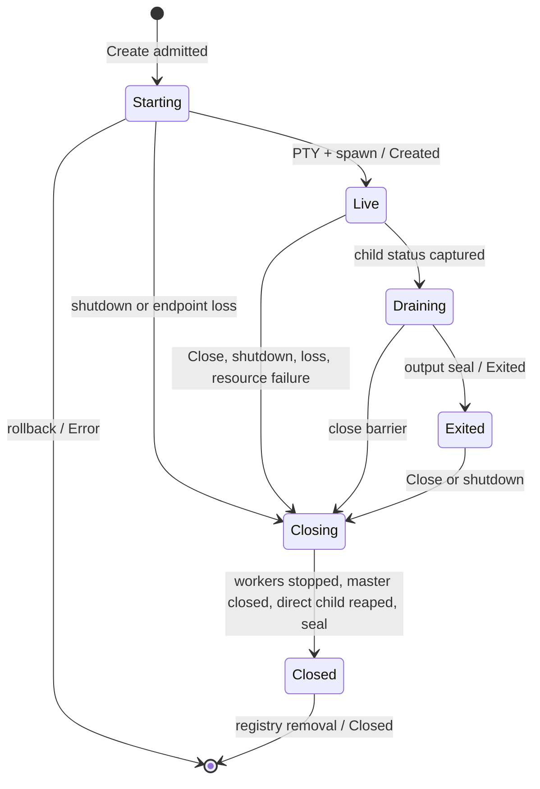
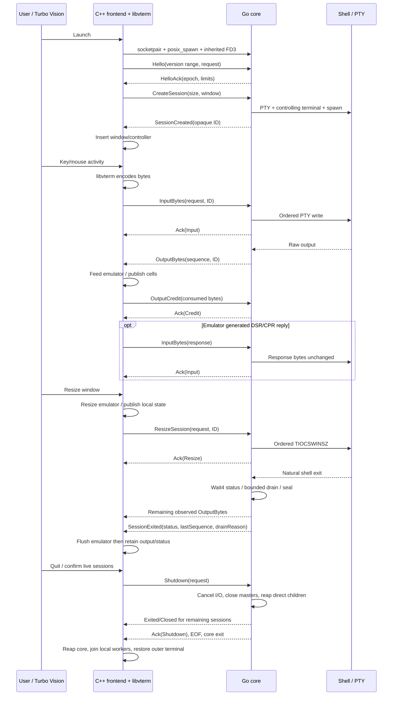

# Go core and C++ presentation architecture

Status: **architecture approved for planning only** by the
[operator review](https://github.com/weshofmann/agent-vision/pull/5#issuecomment-5845488710).
Design and disposable evidence only. No retained backend/migration/dynamic-session
implementation is authorized. D1–D8 in that review govern the implementation plan;
Darwin ownership stays platform-confined, and drain/watchdog timings are named,
tunable implementation policy, not permanent wire compatibility guarantees.
Baseline: accepted main `32a2ad84e4ee6496731c434f1175632c6e9d173b` (PR #4).
Architecture Draft PR: [#5](https://github.com/weshofmann/agent-vision/pull/5).

## 1. Goals and non-goals

Go becomes the sole authority for sessions, PTYs, shells, direct-child status and
lifecycle. C++ retains the accepted Turbo Vision/libvterm presentation and two
terminal UX. Another frontend must be able to use the same backend protocol.
Initial lifecycle is frontend-spawned and connection-scoped. Validate feasibility
on the qualified macOS host before operator review and implementation planning.

No daemon/discovery, reconnect, persistent sessions, remote access, background
services, canonical screen model, dynamic New Terminal, agent harness or descendant
isolation. Linux/Windows are unqualified. Architecture approval is not merge or
next-milestone authorization. Probes do not implement the proposed protocol.

## 2. Component ownership

| Go core owns | C++ frontend owns |
| --- | --- |
| IDs, registry, authoritative live/exited/closed state | Desktop/windows, focus/z-order, menus/dialogs |
| PTY/master FD, spawn, direct-child wait/status | libvterm emulation, cell rendering, local scrollback/selection |
| Input writes, resize ioctl, raw output reads | Terminal-mode-dependent key/mouse/focus encoding |
| Session teardown and backend shutdown | IPC client, cached core metadata, retained output/status UI |
| Validation, sequencing, resource admission | Emulator-generated response bytes sent as ordinary input |

C++ cannot infer shell exit from EOF, signal/reap shells or issue PTY ioctls.
Backend loss means loss of authority/contact, not a known shell exit status.
C++ owns and reaps its direct **Go child**; that topology responsibility is distinct
from terminal-session lifecycle authority.

## 3. Process topology and startup

```text
outer terminal
  agentvision (Turbo Vision + libvterm + core-child owner)
    agentvision-core (IPC + sessions + PTYs + direct shell children)
      shell A (session leader, controlling PTY, ordinary attached jobs)
      shell B (independent controlling PTY)
```

Frontend creates AF_UNIX/SOCK_STREAM socketpair and sets original endpoints
CLOEXEC. Use posix_spawn file actions: close frontend endpoint in child, dup backend
endpoint to FD3, close its original and other unintended FDs. Move the dup source
away from FD3 first: dup2(source==target) may preserve CLOEXEC. Parent closes its
child-end copy after spawn, including failure paths. Resolve packaged sibling
binary without PATH or shell evaluation; argv is `agentvision-core --ipc-fd=3
--mode=frontend-spawned`. FD3 is startup configuration, never a protocol identifier.

Core validates a connected Unix stream, converts through net.FileConn and closes
the original duplicate. No IPC/master descriptors leak into session execs.
Diagnostics use separate stderr and never include raw terminal data/environment.
C++ socket writes use SO_NOSIGPIPE on macOS. Handshake deadline: 2 seconds; no
sessions before handshake. Spawn/handshake failure reports a UI error and cleans
partial resources. Endpoint EOF/crash triggers core teardown. A suspended frontend
is subject to the same slow-consumer policy as a stalled consumer.

## 4. IPC transport decision

| Transport | Benefits | Costs here | Decision |
| --- | --- | --- | --- |
| Inherited socketpair | One bidirectional stream; nameless, no stale files/discovery; close expresses lifetime; C++/Go probe passed | Explicit FD/spawn hygiene; Unix-specific | **Recommend** |
| Framed stdin/stdout | Ordinary pipe/exec plumbing | Two directions/descriptors, diagnostic contamination of stdout, more close coordination | Viable, no material advantage |
| Filesystem Unix socket | Natural listener/attach transport later | Path permissions, discovery, startup/connect races, stale cleanup/auth unnecessary now | Defer |

No gRPC, HTTP, WebSockets, MCP or general RPC framework is justified. Codecs operate
on a reliable byte stream; no socket path/FD in session semantics. Future listener
transport can reuse framing, but needs authentication/attach/lifetime semantics.

## 5. Wire framing and semantics

Proposed v1 uses a 32-byte header and typed binary payloads. Integers use network
byte order; no native structs/ABI, pointers, PIDs as IDs or base64. UTF-8 fields
are u16 byte-length-prefixed, invalid UTF-8/NUL rejected. Terminal data is arbitrary
bytes, independent of any text encoding.

| Offset | Bytes | Field |
| --- | --- | --- |
| 0 | 4 | ASCII AVCP |
| 4 | 2 | Major version; 0 during handshake (including handshake Error), 1 after negotiation |
| 6 | 2 | Message type |
| 8 | 2 | Flags; zero in v1 |
| 10 | 2 | Reserved; zero |
| 12 | 4 | Body length, maximum 65,536 |
| 16 | 8 | Request ID; nonzero request/reply, zero async event |
| 24 | 8 | Session ID; zero connection/Create messages |

Read exactly header then bounded body. Validate header before allocation and body
before dispatch. Handle fragmentation/coalescing, EINTR, short reads/writes; one
writer owns a frame until fully written, advancing its offset. Zero progress is
failure. Mid-frame EOF/malformed data is fatal, no magic resynchronization. A
partial frame expires 2 seconds after its first byte, not extended by byte drips.
Idle established connections have no read timeout. Fatal protocol error attempts
one bounded Error where valid correlation is available, then closes/cleans up;
cleanup cannot depend on delivering that Error.

Hello payload: u16 minMajor,u16 maxMajor. Only [1,1] initially. HelloAck payload:
u16 selectedMajor,u32 maxPayload,u32 capabilities(0),16-byte random backend epoch.
Hello/Ack headers use version 0; all later headers use 1. No overlap yields VERSION
Error and close. No duplicate Hello or pre-handshake traffic. Unknown type/direction,
nonzero reserved/flags/capabilities, bad structural length/enums or request IDs are
fatal. Valid requests against wrong state/session return correlated Error and
leave connection usable.

Frontend request IDs strictly increase, are nonzero, never reused; wrap closes the
connection. At most 81 outstanding globally in separate bounded lanes: 48 ordinary
(Hello/Create/Input/Resize), 16 Credit (one/session), 16 Close (one/session), and
one Shutdown. Ordinary saturation cannot consume control correlation slots.
Excess ordinary requests receive immediate LIMIT without entering work queues;
bounded Error capacity exhaustion instead fails the connection. Duplicate pending
Credit/Close for one session is STATE, not another reserved slot. Every accepted
request receives one
terminal correlated response; across sessions replies may arrive out of order.
Async events have request=0. Core IDs are nonzero opaque u64, never reused within
backend epoch; epoch+ID identifies a run. Do not encode PID/address or claim v1
IDs survive a backend restart. Future persistence requires negotiated semantics.

| Type | Direction | Body and semantics |
| --- | --- | --- |
| 1 Hello | F→B | min/max major; nonzero request, session 0 |
| 2 HelloAck | B→F | Selected version/limits/epoch above, Hello correlation |
| 3 CreateSession | F→B | u16 rows,u16 cols,u32 receiveWindow; session 0; use core's inherited shell/env/cwd, no arbitrary exec options |
| 4 SessionCreated | B→F | Header assigned session ID; u16 rows,u16 cols,u32 acceptedWindow; correlated; successful spawn, precedes all session events |
| 5 InputBytes | F→B | 1..32,768 arbitrary bytes; request≠0; includes emulator replies |
| 6 ResizeSession | F→B | u16 rows,u16 cols, each 1..4096; request≠0 |
| 7 CloseSession | F→B | Empty; request≠0; terminate live or release exited session |
| 8 Shutdown | F→B | Empty, session 0; stop admission and clean sessions; Ack then EOF/core exit |
| 9 OutputBytes | B→F | u64 chunkSequence followed by 1..32,768 raw bytes; async; sequence starts 1 and strictly increments |
| 10 SessionExited | B→F | u8 kind (1 exit,2 signal,3 unavailable),u32 value,u8 coreDump,u64 lastOutputSequence,u8 drainReason; async, exactly once if connection remains usable |
| 11 SessionClosed | B→F | u64 lastOutputSequence; correlated Close completion or async failure close; after Exited/output seal |
| 12 Error | B→F | u16 code,u32 partialInputBytes,u16 length+UTF-8 message (≤1024 bytes); correlated where caused by request, otherwise async |
| 13 Ack | B→F | u16 completed request type; Input means all bytes written, Resize means ioctl applied, Shutdown means owned cleanup complete |
| 14 OutputCredit | F→B | u32 returned raw-byte credit; correlated Ack after accounting validation; excludes header/sequence overhead |

Error code numbers 1..11, respectively: VERSION, PROTOCOL, UNKNOWN_SESSION, STATE,
LIMIT, SPAWN, PTY_IO, INPUT_TIMEOUT, RESIZE, STATUS_UNAVAILABLE, INTERNAL. All body
schemas are exact (no trailing bytes). Exit value is 0..255; signal is a nonzero
core-platform signal number displayed as such, not a cross-platform signal ABI.
Unknown/released IDs return
UNKNOWN_SESSION, including repeat Close; no retry/idempotency framework. Input
failure includes exact written prefix, zero before first write; no automatic
retry. Unavailable status has value=0, never success. coreDump=0 except signals.
No native wait bitfield on wire. Drain reasons: EOF=1, no-data=2, byte-cap=3,
time-cap=4, credit-cap=5, I/O-error=6, explicit-close=7. Caps/error/close indicate
possible unread tail loss; even EOF does not promise descendant supervision.

Accepted PTY Input/Resize commands apply in wire admission order and share one
queue; resize cannot overtake unfinished input. Credit updates are decoder-side
accounting and bypass PTY work, including blocked writes. Close/Shutdown also bypass
that queue as cancellation barriers: their legality/progress never depends on an
ordinary correlation slot. They stop admission, report cancelled requests with STATE or
partial input errors, seal already observed output, then lifecycle. They may
interrupt unfinished/queued commands, but never silently discard completion.
Per-session output/lifecycle FIFO holds regardless of inter-session scheduling.

## 6. Session state machine



Natural exit releases master/I/O after drain but retains typed status in registry
until Close. Frontend retains output until explicit window close. A live Close
captures status and emits Exited before Closed; only one Exited if it races natural
completion. When terminal wait fails, status is unavailable, stop signalling a
possibly reused PID, and quarantine uncertain cleanup rather than claiming a
successful Closed/Shutdown Ack. Backend cleanup has failed in that case.

Cancelling UI confirmation sends no request. Confirmed close suppresses input,
awaits correlated Closed asynchronously, then destroys presentation. Exit/loss
preserves local scroll/selection. Contact loss is displayed as backend lost,
without manufacturing a wait result.

### Starting reservation and shutdown linearization

Connection admission is serialized: validate Create and register a Starting
reservation (request ID, internal session ID, cancellation token, resource owner)
before dispatching any open/spawn work. Reservations count against the 16-session
limit. Shutdown/EOF takes that same admission boundary, stops new admissions and
marks every in-flight reservation cancelled, not just already-live registry entries.
The reservation owns every FD/child returned by work even if cancellation occurs
inside an open/spawn call; it adopts and rolls back the result before resolving.

Before open: cancel without acquiring resources. After open: close master/slave.
After spawn: adopt the child, close parent slave, run normal owned teardown/reap.
Before Created publication: the same admission boundary chooses either Created
commit or cancellation, never both. If cancellation wins on a usable connection,
Create receives exactly one Error(STATE), no public lifecycle for unpublished ID.
Do not start public session output/input dispatch until Created commit; early child
output stays in the PTY kernel buffer, still owned by the Starting reservation.
If Created already committed, Create succeeds and normal Exited/Closed follows.
EOF suppresses undeliverable replies but not ownership cleanup. Shutdown joins all
start completions and session cleanup before Ack: no child or Created can emerge
after Ack. A stuck spawn/open is a cleanup failure subject to core/frontend
watchdogs, not successful shutdown. Deterministic model tests cover all four
pre-publication barriers and the post-Created race for Shutdown and EOF.

## 7. PTY/process lifecycle

Use exact creack/pty v1.1.24 for pty.Open/Setsize; production spawn proposal is
os.StartProcess, not exec.Cmd. Explicit Files={slave,slave,slave} and SysProcAttr
Setsid=true, Setctty=true, Ctty=0 reproduce the library's controlling-terminal
setup. Configure slave termios and initial size before spawning, close parent
slave immediately on success or failure, retain master only after successful
resource adoption. Failed steps roll back both FDs and reservation ownership.
Shell is session leader with controlling terminal and initial process group.
Darwin master creation uses CLOEXEC. Keep all exec streams *os.File. Inherit
intended cwd/env; validate SHELL as absolute regular executable, fallback /bin/sh,
update SHELL, argv[0]=shell, no login flag. Interactive startup files remain
shell-defined. Retain TERM=xterm-256color and COLORTERM=truecolor (the current
VTermEmulatorFactory overrides), without serializing raw env through IPC.
Failed Start/open/initial size rolls back resources before Error.

Current C++ creates explicit canonical/echo/signal flags, control keys and 38400
speeds. Fresh Darwin input/control/local flags and speed differ (output/Ctrl-C/
erase match in the disposable comparison). Preserve the accepted explicit policy
using a narrow audited termios helper on the library-opened slave. The R1 fixture
sets and reads back that policy before os.StartProcess. Do not inherit outer
terminal raw mode or silently treat fresh defaults as accepted V0 equivalence.
This is terminal policy, not handwritten PTY allocation; qualify interactive
control-key/job behavior again at cutover.

Resize uses pty.Setsize/TIOCSWINSZ; driver supplies foreground SIGWINCH. Ctrl-C/Z
remain encoded terminal input with line-discipline/job-control semantics, not
core kill RPC. Closing master supplies normal attached foreground hangup, not
all-descendant termination. No killpg, process-tree discovery or detached-job claim.

### Darwin reaper policy

Cmd.Wait normally owns process wait/ProcessState and exec-created pipe copier
cleanup. PTY *os.File streams create no such copiers. Wait neither drains/closes
master nor waits for PTY EOF; creack/pty does not reap. But installed Go 1.27.0
Darwin `src/os/wait_unimp.go` explicitly warns of concurrent Signal/Wait PID-reuse
race; `exec_unix.go` marks done after kernel wait on this platform. A done channel
cannot remove that interval. See [Go issue #13987](https://github.com/golang/go/issues/13987).

Recommend a narrow macOS lifecycle owner: one goroutine serializes
Wait4(ownedPID,WNOHANG), direct-PID signals and status transitions. Nobody else,
including a SIGCHLD handler, waits this PID. EINTR retries; ECHILD/terminal wait
error stops signalling. Only this owner reaps, so child/zombie retains PID identity
until it does so; it never signals after reap. Process.Release after captured
status and check Release's error; **no Cmd or Cmd.Wait on this path**. Capture
immutable ownedPID before any Release (which sets Process.Pid=-1); use only
that positive owned ID for lifecycle calls and direct-child verification, never
an any-child wait. After reaping, retained numeric ID is diagnostic only and must
never be signalled again.
An earlier exec.Command proposal was
invalid: Wait4+Release leaves Cmd.ProcessState nil and GODEBUG=execwait=2 panics
under explicit GC (independent R1 reproduction). os.StartProcess supplies no Cmd
copier/context/finalizer contract to bypass. No concurrent Process.Wait, external
SIGCHLD reaper, pipe helpers or background exec copiers. Enforce restricted
construction by source audit/tests. This is a small reaper
layer, not handwritten PTY setup. Map syscall.WaitStatus to tagged exit/signal/
core status. Fifty-cycle fixture repeated ten times under execwait/GC/race stress
passes with FD/goroutine baselines restored and termios readback; it cannot force
actual PID reuse. Standard Cmd.Wait observations use their ordinary Wait path and
are separate dependency-behavior probes.

Master reads/writes are nonblocking with single reader and serial input writer.
Use wakeable poll/select or a specifically qualified Go netpoll wrapper, never
assume Close interrupts an os.File created blocking. Probe uses stable captured
FD with bounded nonblocking retry. Do not repeatedly call File.Fd after configuring
mode. Cancel/join workers before closing/reusing descriptor; cancellation wakes
waits and forbids further syscalls.

Close: cancel admission/I/O, join userspace workers (100 ms target), close master,
poll child status, then HUP to still-unreaped direct PID, 250 ms grace, KILL once
and continue polling. Overall cleanup watchdog: 2 seconds per backend, sessions
concurrently (not multiplied by session count). If OS reaping fails to complete,
report failure and retain ownership/reaper, not a successful Ack. This is not a
hard realtime guarantee. Explicit frontend failure cannot force the OS to reap.

## 8. Output and exit ordering

On a usable connection, every successful PTY read admitted by the sole output
owner before exit seal precedes SessionExited. Frontend consumes those chunks,
flushes emulator state, then displays final status. Failure to deliver the stream
means backend lost, not a claimed final status. Raw chunk boundaries are arbitrary.

Lifecycle owner sends a drain barrier to reader instead of enqueueing Exited
independently. Each successful read immediately owns payload/sequence; reader
acknowledges seal only after enqueueing all in-flight read results. A read started
before completion observation counts even if it returns later. Session sequencer
places Exited after seal, and connection writer preserves that session FIFO.

After direct-child completion observation, drain at most 64 KiB additional bytes,
100 ms, available credit/queue capacity, or first no-data/EOF/error, whichever
occurs first. Include already in-flight read (≤32 KiB) even if it crosses byte
cap. Never wait indefinitely for a descendant-held slave. Join reader, close
master, publish exact status + lastSequence + drainReason. Already observed output
is never discarded to meet cap; explicit close also seals it but may lose unread
bytes. No Output after Exited/Closed. Receiver validates sequences/lastSequence.

This is deliberately weaker than all bytes written before process exit: kernel
queues and descendants make that unbounded. Cap/truncation is visible to UI.
No assumption that EOF and child completion arrive in the same order. Slow consumer
can prevent final delivery; timeout then fails connection and still performs cleanup.

## 9. Frontend integration and accepted C++ migration map

Read accepted src/patch against tvterm 210eb235, tvision 6402631, forked libvterm
62b27d1. Source references are relative to those pinned dependency trees.

| Current component | Retain/move |
| --- | --- |
| TerminalController (termctrl.h/cc) | Retain emulator/state/event workers; replace PtyMaster with owned SessionTransport + createWithTransport factory. Private ctor/dtor, nonvirtual API and concrete references prevent subclass-only substitution. |
| PtyMaster (pty.h/cc) | All descriptor/spawn/read/write/ioctl/wait/hangup moves to Go; socket is not a PtyDescriptor. |
| VTermEmulator (vtermemu.cc:256–379,402–455) | Keep libvterm, scrollback, damage, state and encoding. Nonowning Writer must outlive it. |
| TerminalView (termview.cc:15–48,176–228,249–288) | Keep draw, selection, scrollbar/bounds integration; owns controller, calls shutDown when destroyed. |
| BasicTerminalWindow (termwnd.cc:21–73,109–165) | Keep view/frame/scrollbar/title/focus/modal integration; avoid a tvterm clone. |
| AgentVision TerminalWindow (src/window.cpp) | Replace raw wait macros/PID caption/finish with typed core metadata, Close request and local presentation destruction. |
| Application (src/app.cpp) | Core connection, two Creates, insert after Created, existing idle broadcast/menu/confirmation, shutdown barrier. |

Smallest seam: SessionTransport supplies owned byte chunks/end markers, bounded
enqueue of outgoing bytes/resize and cancellation of local waits. AgentVision
IpcSessionTransport uses shared CoreConnection: one socket reader demultiplexes
bounded queues, one socket writer emits whole frames. Initially retain controller
reader/writer workers consuming session queues. Local endpoint cancellation neither
closes shared IPC nor implies process exit. Status comes from backend events.

Keep input path TerminalView→TerminalEvent→VTermEmulator→libvterm output callback
→Writer→InputBytes. **All** Writer emissions use it: keys, UTF-8, mouse/focus
reports and terminal-generated DSR/CPR during OutputBytes consumption
(vtermemu.cc:281,452–455; libvterm state.c:1401–1417). Go writes unchanged bytes,
never duplicates key encoding. Current paste normalizes CR through Turbo Vision;
it does not invoke libvterm bracketed-paste start/end. No new paste behavior promised.

Resize: View bounds→ViewportResize→local emulator resize + ordered ResizeSession.
Publish local state immediately after emulator resize, including silent child;
current controller publishes before resize and may wait for output. Show core
resize error; local desired surface is not proof of applied PTY size.

### Patch decomposition

All pty.h/pty.cc lifecycle hunks become obsolete in C++: forkpty/env/fallback,
master CLOEXEC/nonblocking/polling, waitpid/status/PID safety, drain/stop,
HUP/KILL and ioctl. PTY-specific controller create/finish/status calls also move.
Existing C++ lifecycle tests become historical evidence/replaced with Go tests.

Presentation fixes must survive: joinable owned workers, atomic stop, separate
queueMutex/shared wake predicates, emulator-owned timeouts, queue unlock before
emulator/state locks, final-state flush, dirty flag and TEventQueue::wakeUp.
Scrollbar setParams broadcasts synchronously while draw holds state; sendEvent
must acquire only queue lock, never emulator lock. Preserve real-scrollbar
regression test. Join outside render/state callbacks. No blocking socket calls
under emulator/state locks; resize/replies enqueue with explicit overflow failure.

ClientDataRead contains borrowed spans: IPC queues must own payload, not point into
a reused decoder buffer. End marker follows all accepted bytes; consume/flush
before UI status. After exit/loss still allow local scroll/copy/selection but
suppress emitted process input; current blanket disconnected rejection must narrow.

## 10. Concurrency and backpressure

Proposed v1 limits: 16 admitted/reserved sessions (UI initially two), 48 ordinary
plus 33 reserved control requests as defined above,
256 KiB raw output window/session, 4 MiB aggregate output storage, 128 KiB aggregate
control reserve, 64 KiB input queue/session. Bound metadata/frame allocation
overhead separately; no unbounded event/error/correlation queues. Create accepts
exactly 256 KiB window in v1. Current VTermEmulator::Scrollback bounds history to
10,000 lines (vtermemu.h/pushLine), preserving each line's width. Cell/rendering
memory is separate from IPC budget; extreme dimensions/history can still be costly.
Keep frontend limits explicit rather than equating bounded IPC with total UI memory.

OutputCredit returns raw bytes only after emulator consumes/releases payload.
Frontend coalesces at most one outstanding update/session, flushing consumed
credit within 100 ms even for a quiet stream; it never waits for Input/Resize Ack.
Decoder validates/applies Credit and queues its Ack without acquiring PTY command
worker locks. Valid Credit remains accepted in Draining/Closing/Exited while the
registry exists. After registry removal, late Credit gets UNKNOWN_SESSION (single
correlated completion, no accounting change); client treats that as harmless only
for an already-closed local endpoint. It retains control bookkeeping until reply.
Backend reserves credit at successful read admission, not again at socket send.
Read size ≤available credit/capacity. Account queued/in-flight/unconsumed bytes;
return cannot exceed sent-but-uncredited bytes. Reject double/overflow credits.
No credit pauses PTY reads, eventually backpressuring terminal producers. Reader
of shared IPC continues controls/other sessions; it does not wait under emulator
locks. Advertised window must match frontend queue capacity including in-flight
chunks. Credit overhead excludes sequence/header but those allocations are bounded.

Writer serves output round-robin with bounded chunks. Control byte **and request**
reserves permit credit/cancellation. Command/Error/Credit Acks may use a bounded
priority lane; Created must precede any session event, and Exited/Closed cannot
overtake preceding output. Acknowledging credit does not charge credit again.
No write progress for 2 seconds, or unconsumed sent/queued output without credit progress
for 2 seconds, fails connection and cleans all sessions. Never drop observed bytes
then fabricate Exited. Cleanup bypasses delivery/credit waits on connection loss.

Input/resize workers do not block decoder/reaper. Retry partial write/EAGAIN/EINTR
with cancellation; 1-second deadline from first attempt. Timeout returns exact
prefix Error and initiates session close. Close cancellation replies to pending
requests. Frontend outbound queue reserves room for emulator responses; exhausting
it is explicit failure, never a rendering-lock wait or silent DSR drop. Numerical
budgets are proposals requiring implementation stress qualification.

## 11. Failure behavior

| Failure/trigger | Contract |
| --- | --- |
| Malformed/oversize/version frame | Bounded Error if possible, close, teardown; no unbounded allocation |
| PTY/spawn/initial size failure | Rollback, correlated Error, no Created |
| EOF before child completion | Independent observation, initiate orderly close/reap; never infer code |
| Natural exit | Drain/seal/status, retain exited registry/output |
| PTY I/O failure | Explicit Error + close/seal/status; resize error reports operation failure |
| Frontend normal quit | Shutdown, session cleanup, Ack, core exit; C++ reaps core |
| Frontend crash/EOF | Core cancels I/O, closes masters/reaps direct children and exits after successful cleanup |
| Core crash | Frontend stops input, retains backend-lost display, reaps core; cannot claim shell cleanup |
| Slow consumer | Timeout, fail contact, cleanup independent of writer |
| OS cleanup watchdog failure | Report failure, retain ownership/reaper, no successful completion claim |

Core crash closes masters via OS descriptor cleanup/hangup; no universal descendant
cleanup promise. No automatic restart/reconnect or silent respawn. Frontend similarly
serializes core-child signalling/reaping and never signals an already-reaped PID.
Frontend starts a 2-second deadline when sending Hello or confirmed Shutdown.
If expected completion/core exit is absent, it closes its IPC endpoint, cancels
and joins local connection/presentation waits (100 ms userspace target), reports
forced backend loss, then sends SIGTERM only to its still-owned/unreaped core.
After 250 ms without reap, send SIGKILL once (also handles a SIGSTOP core). Poll
waitpid(WNOHANG) for up to a further second, all signals and waits on one lifecycle
owner. Reaped core is never signalled. Failure to reap after escalation is reported
as OS-level cleanup uncertainty, with ownership retained in a reaper; it cannot
prevent local terminal restoration. After local worker cancellation, detach UI
and restore outer terminal regardless of core cleanup outcome. Normal core Ack
without exit still expires at the same deadline. Forced core death proves nothing
about terminal-shell/descendant cleanup, and is shown distinctly from graceful
Shutdown success. The same policy handles handshake stalls without adding an idle
heartbeat/reconnect feature. Outer terminal restoration remains C++/Turbo Vision;
SIGKILL restoration is not guaranteed. Distinguish loss, exit, parser and cleanup
errors without exposing terminal data.

## 12. Build/package layout (proposal)

Keep CMake/pinned C++ dependencies. Proposed core/go.mod, core/cmd/agentvision-core,
core/internal/protocol, core/internal/session, narrow Darwin lifecycle file;
C++ src/core_connection.* and src/ipc_session.*. Shared language-neutral protocol
spec + literal binary golden fixtures, no ABI bindings/framework. Explicit pinned,
version-checked Go build creates sibling binaries with CMake orchestration and
notices. Validate relocatable packaging, missing sibling and version mismatch.
No installed service, source path embedding or PATH-based core lookup.

## 13. Testing strategy and evidence scope

[Probe report](../../go-core/probe-evidence.md) records question/prerequisite/command,
observed result, limitation and design effect. Eight Go race-enabled tests, C++
FD/framing probe and Python real-PTY IPC harness pass on macOS. They do not qualify
full schema/credit/adapter/daemon behavior. Product code/build is unchanged; no
migration UI qualification claimed. [Disposable source listings](../../../experiments/go-core-architecture/README.md)
materialize executable code only into ignored .probe.

Implementation acceptance must include:

- Cross-language golden frames, decoder fuzz/length/enum/UTF-8/request checks,
  partial/coalesced I/O, EOF mid-frame and first-byte deadlines.
- Real interactive shell default/fallback, controlling tty/session/pgrp, foreground
  job-control/resize/hangup, exact status/core flag, cancellation and FD/worker/child
  baselines; enforce custom reaper stream/no-copy restrictions.
- Deterministic output barrier: hold successful read publication while wait completes;
  assert output before Exited. EOF-before-wait, wait-before-tail, held/continuous
  slave, drain cap, credit exhaustion and slow writer. No dropped observed output.
- Two-session fairness/input/resize/cancel order, malformed traffic/abrupt core and
  frontend loss, resource cleanup independent of socket congestion.
- Real scrollbar callback lock order, wake predicates, payload lifetime, DSR
  roundtrip, silent-child resize, final flush/status, retained selection/scroll,
  local endpoint cancellation without breaking another session.
- Native operator focus/z-order/mouse movement/resize/routing/stty dimensions and
  outer-terminal restoration, supplemented by synthetic desktop checks.

## 14. Implementation PR decomposition after approval

Recommend sequential independently reviewed PRs on accepted main, rather than a
stack before protocol stabilizes:

1. Core protocol + Go PTY/session manager: golden fixtures/codecs, inherited-FD mode,
   serialized Darwin reaper, sequencer/credit/cleanup, independent synthetic client.
   Existing desktop unchanged. Explicitly review reaper restrictions.
2. C++ client + presentation adapter: shared connection, endpoint queues, focused
   tvterm transport patch split from lifecycle patch, typed metadata; fake-core
   tests and emulator/lock/resize qualification; no default cutover yet.
3. Two-terminal cutover: launch Go core from actual desktop, packaging, full native
   and synthetic UX/lifecycle tests; remove obsolete local PTY paths/patch hunks
   and replace tests only after equivalent evidence.
4. Separate dynamic-terminal design/milestone after cutover acceptance. Avoid A/B
   assumptions in backend registry now without adding New Terminal UI.

Each PR bases on main after preceding PR acceptance; merges require separate
operator authorization. If parallel review later has material benefit, exact
stack is PR1→main, PR2→PR1 branch, PR3→PR2 branch. Base/rebase churn around protocol
fixtures/patch is a cost; do not create implementation branches/PRs now.

## 15. Security boundary / non-sandbox statement

Inherited connection avoids filesystem discovery and ordinary unintended access;
it is not a sandbox/credential boundary. Shells run with user's intended env/cwd,
filesystem/network access. Sessions are not isolated tenants; malicious same-user
processes or terminal payloads are not contained. FD hygiene/bounded parsers and
no shell interpolation address accidental leaks/resource exhaustion, not privilege
separation. No production credentials, paid services, host services or weakened
permissions. Public artifacts contain only synthetic sanitized data, no raw env,
private terminal captures or PID-based durable identifiers.

## 16. Deferred persistence/attach implications

Backend has no screen/cell model. Late attach cannot reconstruct current display
without history replay from a known reset/emulator point or future snapshot model.
Unlimited replay adds storage/privacy/cost concerns. Replayed DSR into multiple
emulators can duplicate input responses. Future work must decide emulation/input
ownership, history policy, initial size and multi-frontend resize arbitration.
v1 has no attach history or persistent IDs. New listener/auth/list/attach messages
can reuse framing but require explicitly negotiated semantics and reviewed design.

## 17. Dependency/license findings

Checked 2026-09-26 through upstream API/source: creack/pty is unarchived, last push
2026-06-01; latest tagged release v1.1.24 published 2024-10-31, commit
edfbf75025b0ba4ee17c19f52d9b600fad80a787. MIT copyright Keith Rarick; go.mod minimum
Go 1.18, no module dependencies. Actual probe toolchain Go 1.27.0; minimum is not
host qualification. Pin version/checksums and package MIT notice in implementation.
[Tagged source](https://github.com/creack/pty/tree/v1.1.24),
[release](https://github.com/creack/pty/releases/tag/v1.1.24),
[API](https://pkg.go.dev/github.com/creack/pty),
[exec API](https://pkg.go.dev/os/exec#Cmd.Wait). It supplies PTY setup, not a supervisor.

Existing C++ pins/notices remain tvterm 210eb23564da06c358d2623388939bb02f7f3419
(MIT), tvision 640263136daa67b96a90c9bf6eb8816216ff76a3 (Borland disclaimer/MIT
modifications/embedded notices), forked libvterm 62b27d1db0c49eed55936a1bfa35102be91afe42
(MIT). Keep callbacks/source guards/full notices. Go BSD-style toolchain notices
and any later poll dependency notices as applicable. AgentVision has no chosen
project license/redistribution clearance; this inventory is not legal clearance.

## 18. Risks, open questions and review boundary

Major risks: output seal vs reaper scheduling, credit accounting, C++ lock order,
and restricted custom Darwin reaper. Probes establish feasibility, not full
correctness of those proposed mechanisms. Interactive shell/job-control, complete
wire validation and adapter/native UX qualification belong to implementation PRs.

Operator disposition requested: socketpair/frontend-spawned lifetime; typed binary
protocol/credit; bounded possible-tail-loss contract; single-owner Darwin reaper;
narrow controller seam; sequential PR decomposition. Confirm 2-second slow-consumer/
cleanup watchdog and 64 KiB/100 ms drain as initial policies. No retained migration
starts before operator written-spec approval and subsequent plan review.

Independent review, exact reviewed/tested/head SHAs and remediation are recorded
on Draft PR #5. Keep Draft, stop after publishing review request; no ready/merge
or dynamic-terminal milestone.

## Concrete sequence


